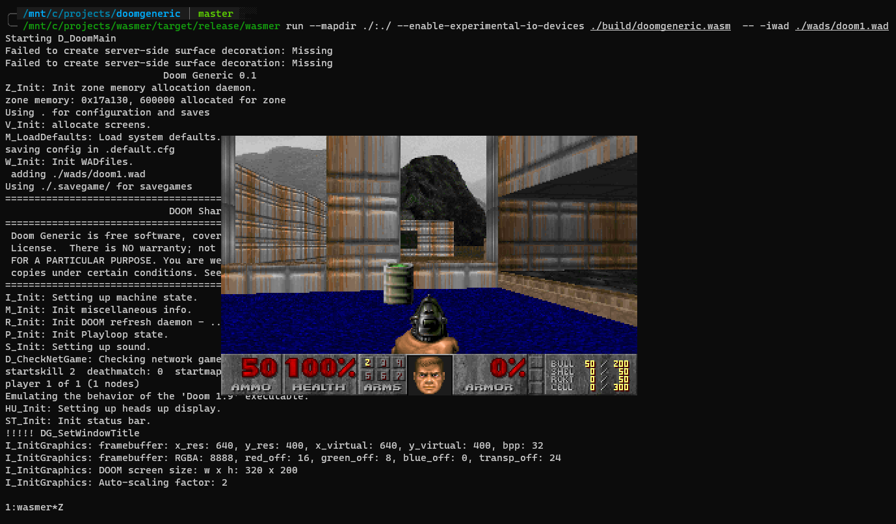

# Doomer

Port of DoomGeneric to WASM runtime [wasmer](https://wasmer.io/).
Uses [wasi-experimental-io-devices](https://github.com/wasmerio/wasmer/tree/master/lib/wasi-experimental-io-devices).
Currently, only runs on my fixed [fork of wasmer](https://github.com/kotborealis/wasmer).



## Building

Builds via [wasienv]([wasienv](https://github.com/wasienv/wasienv)):
```sh
make
```

Artifacts are stored in `./build` directory.

## Running

Make sure to use my forked wasmer, map current directory and enable io devices:
```sh
/kotborealis/wasmer/target/release/wasmer \
  run \
  --mapdir ./:./ \
  --enable-experimental-io-devices \
  ./build/doomgeneric.wasm \
  -- -iwad ./wads/doom1.wad
```
